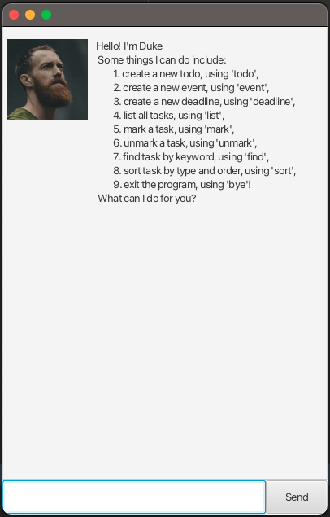

#User Guide
 
Duke Individual Project is a **desktop app for managing tasks**, for use via  a **Graphical User Interface (GUI)**. This project is an extension of the CS2103T Duke Individual Project which I worked on for the CS2103T module while studying Computer Science in the National University of Singapore. This application is built entirely with Java and in Semester 2 of Academic Year 22/23.

--------------------------------------------------------------------------------------------------------------------

## Features
Here is a list of all the features supported by Duke! Scroll down to find more details of each individual feature!
* `todo` to create a new Todo task
* `deadline` to create a new Deadline task
* `event` to create a new Event task
* `mark` to mark a task as done
* `unmark` to unmark a task as done
* `find` to find tasks using a keyword
* `delete` to delete a task
* `sort` to sort a type of task
* `bye' to exit the program

> ⚠️ Important: 
>* All dates must follow the format YYYY-MM-DD
>* Words in `UPPER_CASE` are the parameters to be supplied by the user. 
   e.g. in add `DESCRIPTION`, `DESCRIPTION` is a parameter which can be used as add `Do the dishes`.

### Creating a task: `todo`, `deadline` and `event`

Adds a task.

Format for Todo: `todo DESCRIPTION` 
Format for Deadline: `deadline DESCRIPTION /by YYYY-MM-DD` 
Format for Event: `event DESCRIPTION /from YYYY-MM-DD /to YYYY-MM-DD`

Examples:
* `todo buy groceries`
* `deadline submit iP /by 2023-02-17`
* `event hackathon /from 2023-03-05 /to 2023-03-08`

### Listing all tasks : `list`

Shows a list of all tasks.

Format: `list`

### Marking and un-marking a task : `mark` and `unmark`

Marks/un-marks an existing task in the task list.

Format for Mark: `mark INDEX`

* Marks/un-marks the task at the specified `INDEX`.
* The index refers to the index number shown in the displayed task list when you use the `list` feature. The index **must be a positive integer** 1, 2, 3, …​
* `INDEX` must be provided.

Examples:
*  `mark 1` Marks the 1st task on the list.
*  `unmark 2` Un-marks the 2nd task on the list.

### Locating tasks by description: `find`

Find tasks whose description contain any of the given keywords.

Format: `find KEYWORD [MORE_KEYWORDS]`

* The search is case-sensitive. e.g `hans` will not match `Hans`
* The order of the keywords does matter. e.g. `Hans Bo` will not match `Bo Hans`
* Only the description of the task is searched.
* Non-full words will be matched e.g. `Han` will match `Hans`

### Deleting a task : `delete`

Deletes the specified task from the task list.

Format: `delete INDEX`

* Deletes the task at the specified `INDEX`.
* The index refers to the index number shown in the displayed task list when you use the `list` feature.
* The index **must be a positive integer** 1, 2, 3, …​

Examples:
* `delete 2` deletes the 2nd task in the task list.

### Sorting tasks : `sort`

Sorts the tasks according to type and order.

Format: `sort TYPE ORDER`

* `TYPE` only takes in the 3 types of tasks previously mentioned, `todo`, `deadline` and `event`
* `ORDER` only takes in 2 possible arguments, `ascending` or `descending`

Examples:
* `sort event ascending` displays all events in ascending order

### Exiting the program : `bye`

Exits the program.

Format: `bye
* `bye` is case-insensitive. e.g. `bye` and `bYe` will both exit the program

### Saving the data

Task list data are saved in the hard disk automatically after any command that changes the data. There is no need to save manually.

--------------------------------------------------------------------------------------------------------------------

## THANK YOU FOR USING DUKE!!!